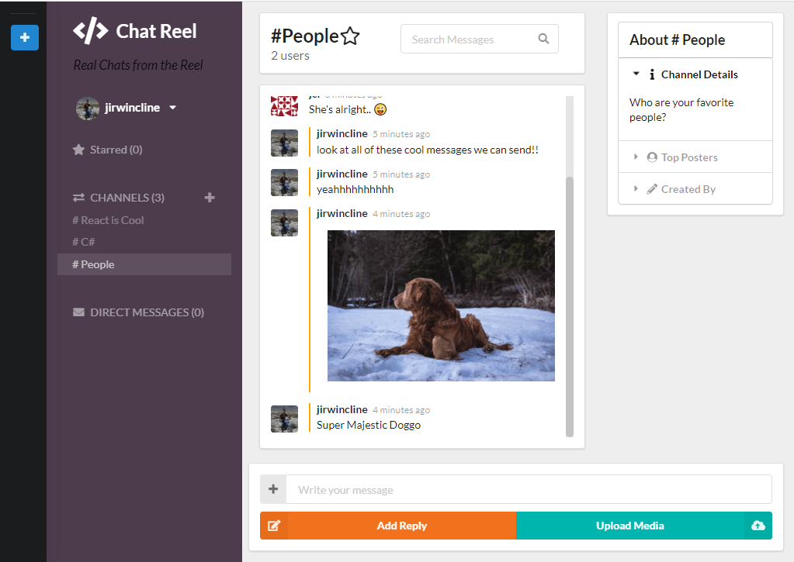

<h1 align="center"> Slack Clone </h1>  

#### Message Your Friends!

<!-- START doctoc generated TOC please keep comment here to allow auto update -->
<!-- DON'T EDIT THIS SECTION, INSTEAD RE-RUN doctoc TO UPDATE -->

## Table of Contents

- [Introduction](#introduction)
- [Hosting](#hosting)
- [Features](#features)
- [Technologies](#technologies)
- [Build](#build)
- [Bugs](#bugs)
- [Contact](#contact)

<!-- END doctoc generated TOC please keep comment here to allow auto update -->

## Introduction

_A react Project that lays out some basic, and some extra fun slack functionality. Chat with friends, keep track of work talk, or upload memes for your meme cred. Hope you enjoy!_

**Desktop design focused**

  

## Hosting

_Link to hosted site:_
[Firebase hosted site](https://react-slack-clone-bb600.firebaseapp.com)

## Features

A few of the things you can do with the app:

- Register and log in to a user account
- Send messages in dedicated channels
- Create yur own channels
- Send messages directly to users, or in private channels
- Upload avatar images or send images as a chat
- Use your favorite emojis from the emoji picker!
- Change the color scheme to your liking
- Star your favorite channels!

## Technologies

- JavaScript
- React.js
- Redux
- VS Code
- Git and Github
- Firebase
- SemanticUI

## Build

#### To build on your own machine

- Clone or download the repo
- Navigate into that repo with `cd Slack-clone`
- `npm` to install dependencies
- `npm run start` to run the project on localhost
- Open your preffered browser and navigate to https://localhost:3000

## Bugs

Images become unreadable as time passes. Likely a firebase file targetting issue in the code.

typing notification isn't present on hosted site

## Contact

If you'd like to inquire about any details, or have questions about the technology, feel free to contact me.

Email:

- jci@pdx.edu

### License

- _This software is licence under the MIT license._
